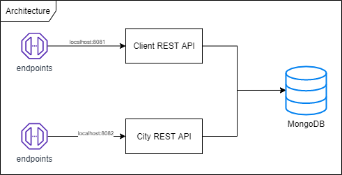

# Spring Boot Interview Implementation

This is the implementation of the challenge proposed in [gustavodallanora/spring-boot-interview](https://github.com/gustavodallanora/spring-boot-interview)

## Documentation

An overview of the project can be seen in the diagram below



The full documentation can be found in

```
/documentation
```

It is composed by two swagger YAML files. To visualize it, copy the content of one of the files and go to [Swagger Editor](http://editor.swagger.io/), then paste it. You'll see the documentation being generated by the swagger online editor.

## Getting Started

These instructions will get you a copy of the project up and running on your local machine for development and testing purposes.
If you only want to execute the project, please see Deployment notes.

### Prerequisites

If you want to run the code, then you will need the following software installed

```
Docker 19.03.8
Apache Maven 3.6.3
Java 1.0.8_241
```

If you just want to execute a stable version of the project descripted in the Deployment section, you will just need the following instaled

```
Docker 19.03.8
```

### Installing

A step by step series of examples that tell you how to get a development env running

Download the project into your local workspace folder

```
git clone https://github.com/iwhrim/spring-boot-interview-implementation.git
```

There are 2 microservices in this project. Client and City. Choose which one you want to work with and go to its folder

```
/client
/city
```

Import the projeto into your favorite IDE.
If you are using IntelliJ, you can import the pom.xml file to open the project.

## Deployment

You can run a stable version of the project by navigating to /v1 and then running the following command on your favorite terminal

```
cd /v1/
```

And then running the following command, on your favorite terminal, to bring up 3 docker containers

```
docker-compose up
```

Then, you acess the endpoints below to check for health status

```
localhost:8081/actuator/health
localhost:8082/actuator/health
```
You should see the following return

```
{
    "status": "UP"
}
```

## Built With

* [Maven](https://maven.apache.org/) - Dependency Management
* [Spring Boot](https://spring.io/projects/spring-boot) - The framework used
* [Data Mongo DB](https://spring.io/projects/spring-data-mongodb) - Integration with the MongoDB
* [Swagger](https://swagger.io/) - Documentation
* [Actuator](https://docs.spring.io/spring-boot/docs/current/reference/html/production-ready-features.html) - Monitoring, metrics, traffic, etc
* [Lombok](https://projectlombok.org/) - Annotations to generate standard boilerplate codes
* [Model Mapper](http://modelmapper.org/) - Object Mapping
* [JUnit4](https://junit.org/junit4/) - Framework to write tests
* [AssertJ Core](https://joel-costigliola.github.io/assertj/index.html) - Fluent assertions
* [Mockito](https://site.mockito.org/) - Mocking framework for unit tests

## Authors

* **Gustavo Teixeira** - *Initial work* - [iwhrim](https://github.com/iwhrim)

## License

This project is licensed under the MIT License - see the [LICENSE.md](LICENSE.md) file for details

## Acknowledgments

* Moura
* Posser
