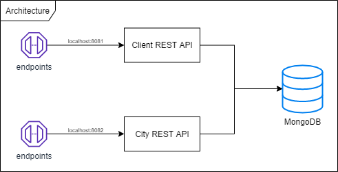

# Documentation

An overview of the project can be seen in the diagram below

The full documentation is composed by two swagger YAML files. To visualize it, copy the content of one of the files and go to [Swagger Editor](http://editor.swagger.io/), then paste it. You'll see the documentation being generated by the swagger online editor and it should look like the image below.

